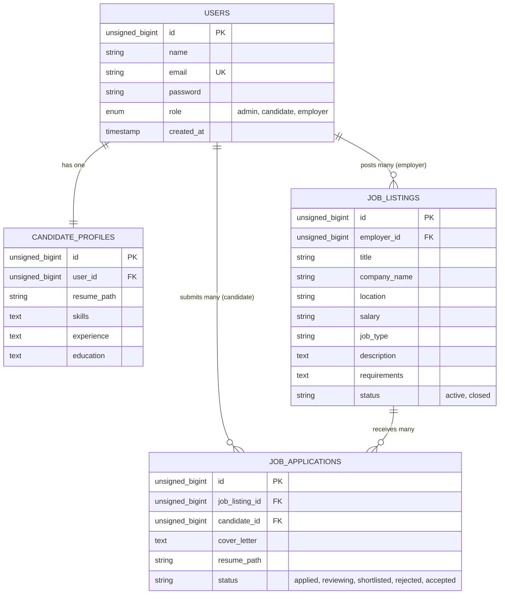

# Job Portal Backend API

A production-grade, secure RESTful API backend for a modern Job Portal application, built with **Laravel 11** and authenticated via **Laravel Sanctum**.

The system provides robust role-based access controls separating Candidates (job seekers) and Employers (recruiters) alongside automated database schema constraints, validation rules, resume upload storage, and analytics dashboards.

---

## 🚀 Key Modules & Capabilities

### 👥 1. Candidate Registration & Profile
* **Contextual Signup:** Register users with candidate-specific details. Registration automatically provisions a profile instance in the database.
* **Resume Workspace:** Upload PDF/DOC/DOCX files (up to 5MB) securely onto the local storage disk with automatic cleanup of outdated files.
* **Metadata Profile:** Let candidates update their active skills list, work experience, and educational qualifications.

### 💼 2. Job Posting & Management (Employer-Only)
* **Employer CRUD:** Post, edit, view, and close job postings.
* **Access Control:** Middleware guards ensure only authenticated Employers can manage listings, and they are strictly restricted to updating/deleting only their own posts.
* **Search & Filters:** Publicly accessible endpoint supporting text searches (matching job title, company name, description, requirements) and categorical filters (location and job type, e.g., Remote, Full-time).

### 📝 3. Job Application Tracking
* **Applications Pipeline:** Candidates can apply to active postings, submit custom cover letters, and freeze a snapshot of their current resume for the recruiter.
* **Integrity Guard:** Restricts candidate duplicate submissions and rejects applications if the candidate has not uploaded a resume.
* **Employer Assessment Workspace:** Employers can fetch details of all candidates who applied for their job postings and update their candidate pipeline statuses (applied, reviewing, shortlisted, rejected, accepted).

### 📊 4. Employer Analytics Dashboard
* **Metrics Compiler:** Consolidates analytics for logged-in employers:
  * Total jobs posted and count of active listings.
  * Total application counts across all their postings.
  * Breakdown of applications by pipeline status (applied, reviewing, shortlisted, rejected, accepted).
  * Recent activity feed (top 5 latest submissions with candidate details, job titles, and downloadable resume links).

---

## 🛠️ Technology Stack
* **Framework:** Laravel 11 (PHP 8.2+)
* **Authentication:** Laravel Sanctum (Token-based API authentication)
* **Database:** MySQL / MariaDB (via Eloquent ORM)
* **Testing:** PHPUnit (Feature and integration testing)

---

## 💾 Database Schema



---

## 📡 API Endpoint Specifications

### 🔑 Authentication Endpoints
| Method | Path | Authentication | Description |
| :--- | :--- | :--- | :--- |
| `POST` | `/api/register` | Public | Register user (validated name, email, password, and role `candidate` or `employer`). |
| `POST` | `/api/login` | Public | Login credentials, returns token, user info, and role. |
| `POST` | `/api/logout` | Authenticated | Revokes current Sanctum access token. |
| `GET` | `/api/profile` | Authenticated | Returns logged-in user profile attributes. |

### 💼 Job Listing Endpoints
| Method | Path | Authentication | Description |
| :--- | :--- | :--- | :--- |
| `GET` | `/api/jobs` | Public | List active jobs. Filters: `keyword`, `location`, `job_type`. |
| `GET` | `/api/jobs/{id}` | Public | Get details of a single job listing. |
| `POST` | `/api/jobs` | Employer Only | Post a new job listing. |
| `PUT` | `/api/jobs/{id}` | Employer Only | Update an existing job listing (verifies ownership). |
| `DELETE` | `/api/jobs/{id}` | Employer Only | Delete a job listing (verifies ownership). |

### 👥 Candidate Workspace Endpoints
| Method | Path | Authentication | Description |
| :--- | :--- | :--- | :--- |
| `POST` | `/api/candidate/resume` | Candidate Only | Upload a resume document (PDF/DOC/DOCX). |
| `PUT` | `/api/candidate/profile` | Candidate Only | Update candidate skills, experience, and education. |
| `POST` | `/api/jobs/{id}/apply` | Candidate Only | Apply to a job posting (requires cover letter; checks for resume). |
| `GET` | `/api/candidate/applications` | Candidate Only | Fetch applications submitted by the logged-in candidate. |

### 🏢 Employer Workspace Endpoints
| Method | Path | Authentication | Description |
| :--- | :--- | :--- | :--- |
| `GET` | `/api/jobs/{jobId}/applications` | Employer Only | List applications received for a specific posting. |
| `PUT` | `/api/applications/{id}/status` | Employer Only | Update applicant pipeline status. |
| `GET` | `/api/employer/dashboard` | Employer Only | Fetch metrics (totals, status counts, and recent activity). |

---

## ⚙️ Installation & Setup

1. **Navigate to the Backend Directory:**
   ```bash
   cd d:/React/jobPortal/backend
   ```

2. **Install Dependencies:**
   ```bash
   composer install
   ```

3. **Configure Environment Variables:**
   * Duplicate `.env.example` as `.env`.
   * Configure your database credentials:
     ```env
     DB_CONNECTION=mysql
     DB_HOST=127.0.0.1
     DB_PORT=3306
     DB_DATABASE=jobportal
     DB_USERNAME=root
     DB_PASSWORD=
     ```

4. **Generate Application Key:**
   ```bash
   php artisan key:generate
   ```

5. **Execute Database Migrations:**
   ```bash
   php artisan migrate:fresh
   ```

6. **Link File Storage (for Resumes):**
   ```bash
   php artisan storage:link
   ```

7. **Start Development Server:**
   ```bash
   php artisan serve
   ```
   *The server will boot locally, typically at `http://127.0.0.1:8000`.*

---

## 🧪 Running Automated Tests
The project features 100% test coverage for API routes, roles, and status flows in the [JobPortalTest.php](file:///d:/React/jobPortal/backend/tests/Feature/JobPortalTest.php) class.

Run the test suite using:
```bash
php artisan test
```
