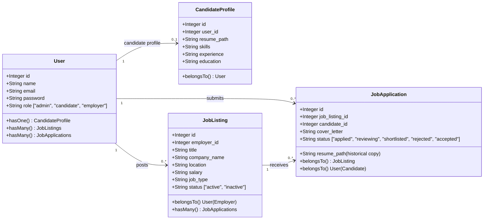

# Job Portal Backend: Project Architecture & Flow Guide

This document provides a comprehensive guide to the architecture, directory structure, file roles, and API flow of the Job Portal backend. You can share this document with your team manager and developers to explain the project design in detail.

---

## 1. Project Overview
The Job Portal backend is built on **Laravel 11** utilizing **Laravel Sanctum** for secure token-based API authentication. The portal supports three distinct roles with custom middleware restrictions:
* **Admin:** System administrator seeded initially. Can spawn other administrators. Cannot register publicly.
* **Candidate (Job Seeker):** Can register publicly, build a profile, upload resumes, and apply to job listings.
* **Employer:** Can register publicly, post and manage job listings, review applications, update status pipelines, and view dashboard metrics.

---

## 2. How to Set Up and Run the Project

Follow these steps to run the backend application locally:

### Step 1: Install Dependencies
Run composer to install PHP dependencies:
```bash
composer install
```

### Step 2: Configure the Environment
1. Copy `.env.example` to `.env`:
   ```bash
   cp .env.example .env
   ```
2. Generate an application encryption key:
   ```bash
   php artisan key:generate
   ```
3. Update database credentials in your `.env` file:
   ```env
   DB_CONNECTION=mysql
   DB_HOST=127.0.0.1
   DB_PORT=3306
   DB_DATABASE=job_portal
   DB_USERNAME=root
   DB_PASSWORD=your_password
   ```

### Step 3: Run Database Migrations and Seeding
Run migrations to set up the schema and run seeders to create the initial admin account:
```bash
php artisan migrate:fresh --seed
```
*This command runs DatabaseSeeder.php, creating the default admin user: **admin@gmail.com** / **12345678**.*

### Step 4: Link Storage Disk (For Resumes)
Link the storage directory so uploaded resumes are publicly accessible:
```bash
php artisan storage:link
```

### Step 5: Start the Development Server
```bash
php artisan serve
```
*The local API will be accessible at `http://127.0.0.1:8000`.*

### Step 6: Run Tests
Execute the feature test suite to verify everything works:
```bash
php artisan test
```

---

## 3. Directory Structure & Key Files

Here is the purpose of each key file in this project:

```
jobPortal/backend/
├── app/
│   ├── Http/
│   │   ├── Controllers/
│   │   │   └── Api/
│   │   │       ├── AuthController.php            # Handles login, logout, registration, profile lookup
│   │   │       ├── AdminController.php           # Admin-only user creation (spawning new admins)
│   │   │       ├── CandidateController.php       # Handles candidate profile details & resume uploads
│   │   │       ├── JobController.php             # Handles job listings CRUD & public searching/filtering
│   │   │       ├── JobApplicationController.php  # Handles job applications (apply, fetch, update status)
│   │   │       └── EmployerDashboardController.php # Employer dashboard totals, stats & application pipeline
│   │   ├── Middleware/
│   │   │   ├── AdminMiddleware.php               # Restricts routes to Admin role only
│   │   │   ├── CandidateMiddleware.php           # Restricts routes to Candidate role only
│   │   │   └── EmployerMiddleware.php            # Restricts routes to Employer role only
│   │   └── Requests/
│   │       ├── RegisterRequest.php               # Form request validation for user registration
│   │       └── LoginRequest.php                  # Form request validation for user login
│   └── Models/
│       ├── User.php                              # Root user model containing roles & relationships
│       ├── CandidateProfile.php                  # Candidate-specific profile (resume_path, skills, education)
│       ├── JobListing.php                        # Job postings model (employer owner, status, requirements)
│       └── JobApplication.php                    # Application tracking model (relates candidate to job listing)
├── bootstrap/
│   └── app.php                                   # Registers middleware aliases (admin, candidate, employer)
├── database/
│   ├── migrations/                               # Database migrations defining the schema
│   └── seeders/
│       └── DatabaseSeeder.php                    # Seeds the first administrator account
└── routes/
    └── api.php                                   # Entry point routing definitions for all backend APIs
```

---

## 4. Architectural Model Relationships



---

## 5. Flow of Key System Operations

### A. Authentication & Sign-Up Flow
1. **Public Registrations (`POST /api/register`):**
   * Handled by RegisterRequest.php validator.
   * `role` must be `'candidate'` or `'employer'` (preventing public admin registration).
   * If role is `'candidate'`, a blank CandidateProfile is automatically initialized in the database.
2. **Public Login (`POST /api/login`):**
   * Authenticates user email/password, issues a Sanctum Bearer Token, and returns the user's role.

### B. Admin Flow (Initial Seeding & Expansion)
1. **Seed first admin:** Run `php artisan db:seed`. This creates `admin@gmail.com` with role `admin`.
2. **Login as Admin:** Hitting `/api/login` yields a Sanctum token.
3. **Add Next Admin (`POST /api/admin/create-admin`):**
   * Route is secured by `auth:sanctum` and AdminMiddleware.php.
   * Authenticated admin passes the name, email, and password of the new admin.
   * Controller writes the user to the database with `role => 'admin'`.

### C. Candidate Career Flow
1. **Profile Building (`PUT /api/candidate/profile`):**
   * Candidate updates skills, experience, and education details.
2. **Resume Upload (`POST /api/candidate/resume`):**
   * Validates file is PDF/DOC/DOCX up to 5MB.
   * Uploads file to local disk under `public/resumes` and stores the file path in their CandidateProfile.
   * Automatically deletes old resumes to save space.
3. **Applying for Jobs (`POST /api/jobs/{id}/apply`):**
   * System verifies that the candidate has uploaded a resume.
   * Prevents duplicate applications to the same job.
   * Saves a reference to the active resume and cover letter in the JobApplication record.

### D. Employer Recruitment Flow
1. **Job Posting CRUD (`POST /api/jobs`, `PUT /api/jobs/{id}`, `DELETE /api/jobs/{id}`):**
   * Employers can create, update, or close (delete) job openings.
   * *Security check:* Middleware ensures only employers can write jobs; controller ownership validation prevents employers from modifying jobs they did not author.
2. **Reviewing Applications (`GET /api/jobs/{jobId}/applications`):**
   * Employers fetch applications for their listings, receiving candidate profiles and resume paths.
3. **Pipeline Status Update (`PUT /api/applications/{id}/status`):**
   * Employer transitions an application through states: `applied` ➔ `reviewing` ➔ `shortlisted` ➔ `accepted`/`rejected`.
4. **Dashboard Analytics (`GET /api/employer/dashboard`):**
   * Displays totals (jobs posted, active jobs, applications received).
   * Breaks down application status counts (shortlisted, accepted, etc.).
   * Lists the 5 most recent application submissions with profile snapshots.
